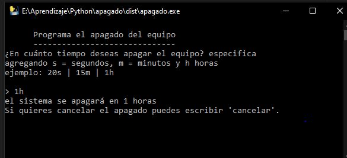

# Programa Apagado

Programa el apagado del equipo en un tiempo determinado

## Instalación

Clonar el repositorio
`git clone https://github.com/D4ITON/apagado.git`

Crearemos el .exe (para sistema operativo windows)

Instalamos pyinstaller ejecutando:
`pip install pyinstaller`

Ejecutamos el commando
`pyinstaller --onefile apagado.py`

Eso nos creará las carpetas /dist y /build donde en /dist se encontrará el .exe

## Uso

Ejecutamos ya sea desde el archivo .py o .exe y nos mostrará una ventana de en cuanto tiempo queremos apagar el equipo
Tiempos validos: 20s | 15m | 1h

 
 
<i>@dalthonmh</i>
